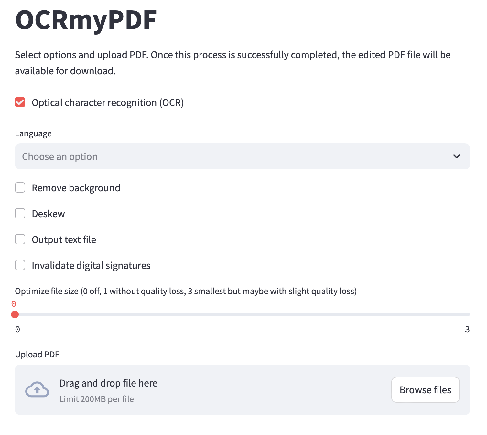

# OCRmyPDFonWEB

Streamlit Web UI for OCRmyPDF. Its codebase is tiny, so if you want to modify it, it should be straightforward. It is also stateless, making it easy to deploy. No volumes. No configuration.



## Requirements

* tesseract [tesseract-ocr](https://tesseract-ocr.github.io/tessdoc/Installation.html)
* ghostscript [ghostscript](https://www.ghostscript.com/)
* tesseract-lang [tesseract-lang](https://formulae.brew.sh/formula/tesseract-lang#default)

## Develop

```
python3 -m venv venv
source venv/bin/activate
pip install -r requirements.txt
streamlit run server.py
```

Open http://localhost:8501